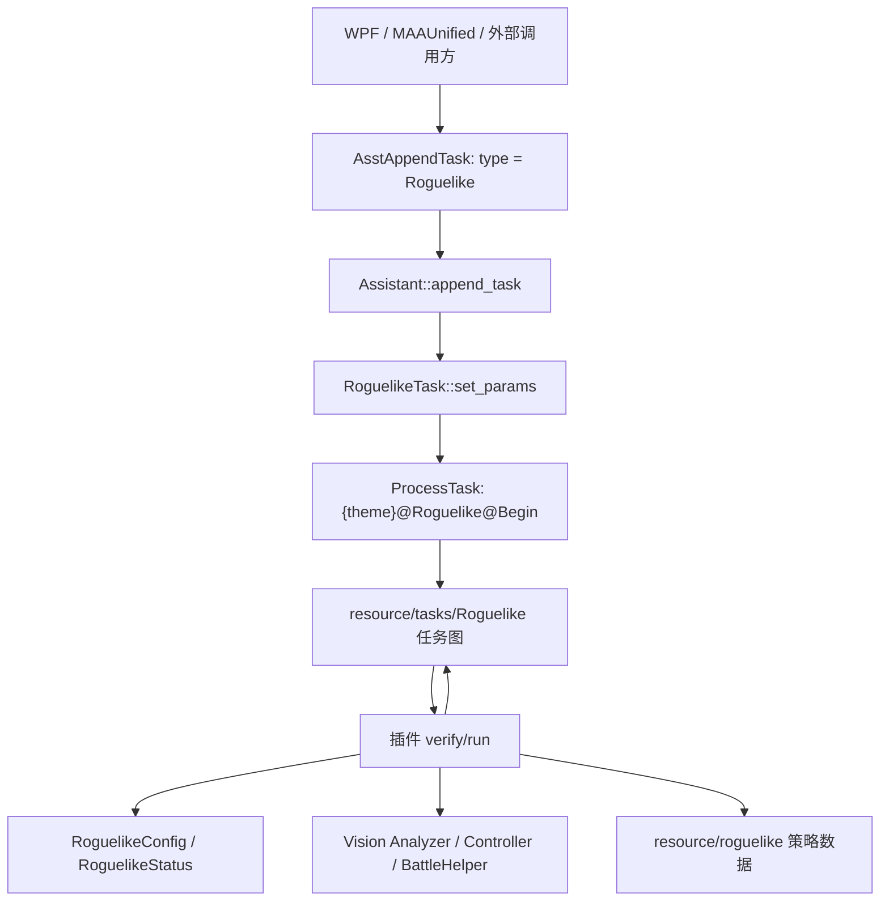
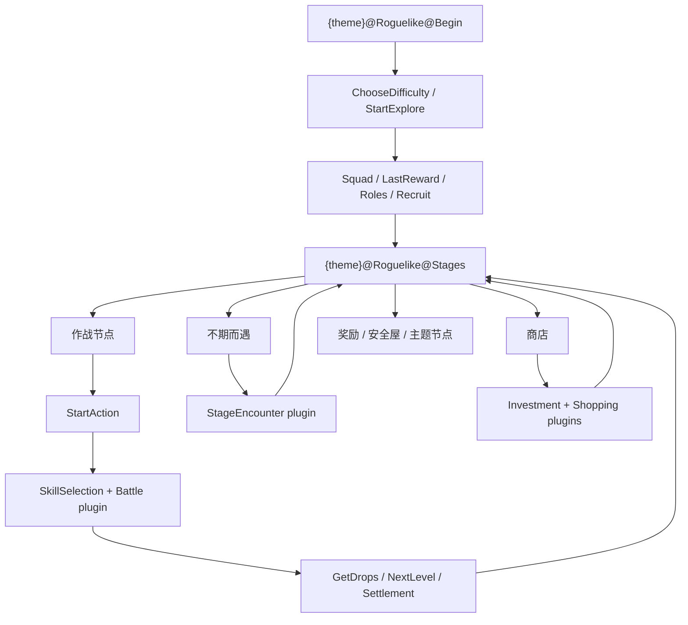

# 自动肉鸽实现概览

::: tip
本文面向需要维护自动肉鸽实现的开发者，描述 Core、资源任务图、策略 JSON、UI/API 参数之间的协作关系。配置字段的用户协议说明请优先参考 [集成战略协议文档](../protocol/integrated-strategy-schema.md)。
:::

## 一句话架构

自动肉鸽是“资源任务图 + C++ 插件”的混合实现：

- `resource/tasks/Roguelike/*.json` 描述稳定的 UI 流转、识别锚点、点击动作和 `next` 跳转。
- `src/MaaCore/Task/Roguelike/**` 的插件在关键任务节点收到回调后介入，处理招募、战斗、商店、事件、寻路、结算等需要程序决策的逻辑。
- `resource/roguelike/<theme>/**` 提供主题策略数据，例如招募优先级、作战部署、商店购买、事件选项、地图节点和主题专属配置。
- WPF 与 MAAUnified 只负责编译 `Roguelike` 任务参数，最终都通过 `AsstAppendTask(handle, "Roguelike", params)` 进入 Core。



## 入口与生命周期

1. 外部 API 入口是 `include/AsstCaller.h` 的 `AsstAppendTask`，任务类型传入 `Roguelike`。
2. `src/MaaCore/Assistant.cpp` 在 `Assistant::append_task` 中把 `Roguelike` 映射为 `RoguelikeTask`，解析 JSON 参数后调用 `set_params()`。
3. `RoguelikeTask` 构造一个 `ProcessTask`，注册所有肉鸽插件，持有共享的 `RoguelikeConfig` 和控制插件。
4. `RoguelikeTask::set_params()` 校验并加载参数，把起始任务设为 `{theme}@Roguelike@Begin`，再按模式改写若干任务基类和次数限制。
5. `ProcessTask` 按资源任务图截图、识别、执行动作、走 `next/onErrorNext/exceededNext`。每次子任务开始或完成都会发回调，`AbstractTaskPlugin` 先于外部回调处理这些消息。
6. 插件的 `verify()` 根据回调类型和当前任务名决定是否接管，`_run()` 可以继续运行局部 `ProcessTask`、点击/滑动、更新状态、回调 UI、或用 `Task.set_task_base()` 改写后续流程。
7. 一局开始时 `RoguelikeResetTaskPlugin` 在 `Roguelike@StartExplore` 触发，调用所有肉鸽插件的 `reset_in_run_variables()`，再清空 `RoguelikeConfig::status()`。

这一套设计的关键约定是：**JSON 任务名是插件协议**。改名或拆分任务节点时，必须同步检查所有插件 `verify()` 中对任务名的匹配。

## 主要目录

| 路径 | 职责 |
| --- | --- |
| `src/MaaCore/Task/Interface/RoguelikeTask.*` | 自动肉鸽任务入口，装配 `ProcessTask`、共享配置和插件，并按参数改写任务图。 |
| `src/MaaCore/Task/Roguelike/RoguelikeConfig.*` | 参数校验、模式选择、运行态 `RoguelikeStatus`。 |
| `src/MaaCore/Task/Roguelike/*.cpp` | 通用插件：控制、重置、难度、开局、招募、编队、技能、战斗、商店、投资、事件、结算、层数策略等。 |
| `src/MaaCore/Task/Roguelike/Map/*` | 萨卡兹与界园的地图寻路，包含普通地图 DAG 和界园树洞固定网格。 |
| `src/MaaCore/Task/Roguelike/Sami/*` | 萨米密文板、开局密文板、坍缩范式。 |
| `src/MaaCore/Task/Roguelike/JieGarden/*` | 界园通宝拾取和交换。 |
| `src/MaaCore/Config/Roguelike/**` | 解析 `resource/roguelike` 下的招募、商店、作业、事件、地图、主题专属配置。 |
| `src/MaaCore/Vision/Roguelike/**` | 肉鸽专用视觉分析器，例如招募、编队、技能选择、事件选项、通宝。 |
| `resource/tasks/Roguelike/*.json` | 任务图层。`base.json` 是通用流程，各主题 JSON 覆盖或扩展节点，`routing.json` 放地图寻路节点。 |
| `resource/roguelike/<theme>/**` | 策略数据层。每个主题包含 `autopilot`、`recruitment.json`、`shopping.json`、`encounter`，部分主题有额外文件。 |
| `src/MaaWpfGui/**/Roguelike*` | 旧 WPF UI 的配置、序列化和回调日志展示。 |
| `src/MAAUnified/Application/Services/TaskParams/TaskParamCompiler.cs` | MAAUnified 参数读取、校验和编译。 |

## 任务图机制

肉鸽流程的大部分 UI 识别和跳转在 `resource/tasks/Roguelike` 中声明。

- `base.json` 提供通用节点，例如 `Roguelike@Begin`、`Roguelike@StartExplore`、`Roguelike@Stages`、`Roguelike@StartAction`、`Roguelike@StageEncounter*`、`Roguelike@StageTrader*`、`Roguelike@StrategyChange`。
- `Phantom.json`、`Mizuki.json`、`Sami.json`、`Sarkaz.json`、`JieGarden.json` 提供主题入口、模板、主题节点和特殊 `next`。
- `routing.json` 为 `RoguelikeRoutingTaskPlugin` 和 `RoguelikeBoskyPassageRoutingTaskPlugin` 提供节点模板、坐标参数和路由后的动作节点。
- 主题任务常通过 `baseTask` 继承通用节点。`TaskData` 会按任务名合并配置，`#self` 表示自身，`X#next` 表示展开某任务的 `next`。
- `Task.set_task_base(name, base)` 是运行时改图的主要方式。参数加载、楼层策略切换、寻路结果、投资模式、数据收集模式都会使用它。

典型主线如下：



## 参数与模式

Core 中的主题和模式定义在 `RoguelikeConfig.h`：

| 模式 | 值 | 适用范围 | 说明 |
| --- | ---: | --- | --- |
| `Exp` | `0` | 通用 | 刷经验，尽量稳定推进。 |
| `Investment` | `1` | 通用 | 刷源石锭，投资后按配置退出或继续刷分。 |
| `Collectible` | `4` | 通用 | 刷开局奖励、烧水、凹开局直升。 |
| `CLP_PDS` | `5` | Sami | 刷隐藏坍缩范式。 |
| `Squad` | `6` | 通用 | 月度小队。 |
| `Exploration` | `7` | 通用 | 深入调查。 |
| `FastPass` | `10001` | Sarkaz | Core 支持的快速通过第一层实验模式，当前 WPF/MAAUnified 未作为普通 UI 模式暴露。 |
| `FindPlaytime` | `20001` | JieGarden | 第一层进洞，寻找指定常乐子节点。 |
| `DataCollection` | `20002` | JieGarden | 数据收集，避战并优先记录不期而遇等样本。 |

`RoguelikeConfig::verify_and_load_params()` 会完成这些工作：

- 校验 `theme` 和 `mode` 的组合是否合法。
- 记录难度、分队、投资、刷开局、直升、常乐目标等参数。
- 把 `{theme}@Roguelike@Stages` 初始化到 `{theme}@Roguelike@Stages_default`。
- 把 `{theme}@Roguelike@StrategyChange` 指到模式对应的 `StrategyChange_modeN`。没有对应模式节点时退化为 `#none`。
- 对萨卡兹点刺成锭分队、界园指挥分队、界园 `FindPlaytime/DataCollection` 写入特殊策略基类。
- 拒绝已废弃的 `investment_enter_second_floor`，要求使用 `investment_with_more_score`。
- 校验 `find_playTime_target` 必须在 `1..3`。

`RoguelikeTask::set_params()` 在配置加载后继续设置运行时行为：

- `ProcessTask` 起点为 `{theme}@Roguelike@Begin`。
- 仅 `DataCollection` 模式启动 `RoguelikeDataCollector`，其他模式禁用。
- 界园数据收集会把 `GetDropSelect/GetDropSwitch` 指到 `_dataCollection` 基类。
- 投资模式按 `investment_with_more_score` 改写 `DropsFlag`、`StageTraderInvestCancel`、`StageTraderLeaveConfirm`。
- `stop_at_final_boss` 会禁用非傀影主题五层 Boss 进入节点。
- `starts_count`、`investment_enabled`、`refresh_trader_with_dice` 会转为 `ProcessTask` 次数限制。
- 遍历所有 `AbstractRoguelikeTaskPlugin`，调用 `load_params()`，用返回值启停插件。

## 共享状态

`RoguelikeConfig` 保存跨插件共享的参数和运行态。参数包括主题、模式、难度、分队、开局干员、助战、刷开局、投资、界园常乐目标等。

`RoguelikeStatus` 是当前一局的共享事实源，包含：

- 通用：希望、生命、楼层、编队上限、已招募干员、已记录藏品。
- 招募：`team_full_without_rookie`。
- 商店：`trader_no_longer_buy`。
- 萨米：抗干扰指数、已获得密文板。
- 萨卡兹：构想数量、负荷、负荷上限。
- 界园：票券数量。

注意这里描述的是代码层的状态字段，不一定等同于游戏内完整真实状态。当前 `ticket_count` 仅是预留字段，代码中没有找到对票券数量的识别写入；界园“票券”目前只在刷开局奖励选择中作为 `JieGarden@Roguelike@LastReward5` 模板匹配目标。`collections` 当前也不是完整藏品背包识别结果，而是商店插件成功购买商品后写入的商品名列表。

跨插件状态应放入 `RoguelikeStatus` 或 `RoguelikeConfig`；单插件临时状态应放在插件成员里，并在 `reset_in_run_variables()` 中清理。

## 插件分工

`RoguelikeTask` 注册的插件大致分为以下几类：

| 插件 | 触发点 | 主要职责 |
| --- | --- | --- |
| `RoguelikeControlTaskPlugin` | 控制任务名 | 停止任务，或先退出/放弃探索再停止。 |
| `RoguelikeResetTaskPlugin` | `StartExplore` | 新一局开始时重置全部插件运行态和 `RoguelikeStatus`。 |
| `RoguelikeDifficultySelectionTaskPlugin` | `StartExplore` | 按目标难度滑动选择；刷开局可临时使用 0 难或界园 3 难。 |
| `RoguelikeCustomStartTaskPlugin` | 分队、开局奖励、职业、开局干员节点 | 劫持选择分队、奖励、职业组、开局干员；处理刷开局奖励和开局直升停止条件。 |
| `RoguelikeRecruitTaskPlugin` | `ChooseOper` | 扫描招募页，按 `recruitment.json` 优先级、队伍完备度、藏品偏移、临时招募等选择干员。 |
| `RoguelikeFormationTaskPlugin` | `QuickFormation` | 必要时清空重选，按核心组和队伍完备条件重排编队。 |
| `RoguelikeSkillSelectionTaskPlugin` | `StartAction` 前 | 识别技能选择页，按招募配置选择主技能/备选技能，并更新干员状态。 |
| `RoguelikeBattleTaskPlugin` | `StartAction` 后 | 识别关卡，加载 `autopilot`，用 `BattleHelper` 自动部署、开技能、撤退、处理超时。 |
| `RoguelikeStrategyChangeTaskPlugin` | `StrategyChange` | OCR 当前层数或策略文本，把 `{theme}@Roguelike@Stages` 切到对应 `Stages_*`。 |
| `RoguelikeStageEncounterTaskPlugin` | `StageEncounterJudgeOption` | OCR 事件名，读取事件配置，按条件和选项文本选择；界园支持动态选项列表和数据记录。 |
| `RoguelikeShoppingTaskPlugin` | `TraderRandomShopping`、数据收集离开商店 | OCR 商品，按 `shopping.json` 购买；数据收集时保存商店图。 |
| `RoguelikeInvestTaskPlugin` | `StageTraderInvestConfirm` | OCR 存款/钱包，批量点击投资，达到上限或满存款时停止。 |
| `RoguelikeLastRewardTaskPlugin` | 刷开局重开高难前 | 重置选点策略，关闭烧水标记。 |
| `RoguelikeSettlementTaskPlugin` | 通关或失败结算 | 保存成就图，OCR 结算数据并回调 UI。 |
| `RoguelikeLevelTaskPlugin` | `StartExplore` | `stop_at_max_level` 下检测等级满级并停止。 |
| `RoguelikeIterateMonthlySquadPlugin` | `StartExplore` | 月度小队自动轮换、通信检查、完成后停用任务。 |
| `RoguelikeIterateDeepExplorationPlugin` | `StartExplore` | 深入调查自动轮换、完成后停用任务。 |
| `RoguelikeInputSeedTaskPlugin` | `StartExplore` | 输入萨卡兹种子并确认。 |
| `RoguelikeRoutingTaskPlugin` | `Roguelike@Routing` | 萨卡兹/界园第一层特殊地图寻路和界园数据收集寻路。 |
| `RoguelikeBoskyPassageRoutingTaskPlugin` | `Roguelike@Routing_BoskyPassage` | 界园树洞固定网格寻路，支持寻找常乐子节点。 |
| `RoguelikeFoldartal*` | 萨米节点、奖励、开局 | 获取、使用、开局筛选密文板。 |
| `RoguelikeCollapsalParadigmTaskPlugin` | 萨米横幅和状态面板 | 跟踪坍缩范式，加深/消退时回调；刷范式模式下按目标停止或重开。 |
| `RoguelikeCoppersTaskPlugin` | 界园 `GetDropSwitch`、`CoppersTakeFlag` | 识别通宝，按优先级拾取或与现有通宝交换。 |

## 资源加载

`ResourceLoader` 在加载通用任务和模板后，同步加载肉鸽资源。这里曾经异步加载，后来改为同步以避免竞态。

加载范围：

- 五个主题：`Phantom`、`Mizuki`、`Sami`、`Sarkaz`、`JieGarden`。
- 每个主题的 `autopilot`、`recruitment.json`、`shopping.json`、`encounter/default.json`。
- `Phantom/Mizuki/Sami` 的 `encounter/deposit.json`。
- `Sami/encounter/collapse.json`。
- `Sarkaz/map.json`、`JieGarden/map.json`。
- `Sami/foldartal.json`、`Sami/collapsal_paradigms.json`。
- `JieGarden/coppers.json`。

`load_with_custom` 会额外尝试加载资源根目录下同名 `_custom.json`，这是历史行为，新增资源时不要误以为自定义文件放在原目录旁边。

`resource/global/*/resource/tasks/Roguelike` 和 `resource/global/*/resource/template/Roguelike` 是国际服或渠道服覆盖层，通常覆盖任务图和模板；主策略数据仍位于 `resource/roguelike`。

## 策略 JSON

完整字段请看协议文档，这里只列程序实现直接依赖的重点。

### 招募

`recruitment.json` 由 `RoguelikeRecruitConfig` 解析。

- `priority` 定义干员组顺序，组名同时被招募、编队和作战部署引用，应保持稳定。
- 干员字段中的 `recruit_priority`、`promote_priority`、`is_alternate`、`is_key`、`is_start` 决定招募核心逻辑。
- `skill`、`alternate_skill`、`skill_usage`、`skill_times`、`auto_retreat` 会影响技能选择和战斗插件。
- `recruit_priority_offsets`、`collection_priority_offsets` 根据当前队伍或已记录藏品动态调整优先级；已记录藏品目前主要来自商店购买成功后的记录。
- `team_complete_condition` 决定阵容是否完备，影响招募过滤和编队重排。

### 作战

`autopilot/*.json` 由 `RoguelikeCopilotConfig` 递归加载，查找键是 JSON 内的 `stage_name`，不是文件名。

- `replacement_home` 定义守家点；缺失时战斗插件会从 TilePack 中寻找 `Home`。
- `blacklist_location`、`not_use_dice`、`role_order`、`force_deploy_direction` 调整通用部署。
- `force_air_defense_when_deploy_blocking_num` 控制阻挡部署数达到阈值后强制补对空。
- `deploy_plan` 和 `retreat_plan` 按击杀数区间、干员组、位置、方向做精确部署和撤退。
- 萨米坍缩范式模式会优先查找 `stage_name + "_collapse"`，没有再退回普通作业。

### 事件

`encounter/*.json` 由 `RoguelikeStageEncounterConfig` 解析。

- `default.json` 是默认事件集，`deposit/collapse` 等带 `mode` 的配置会复制默认集后覆盖同名事件。
- `option_num` 是总选项数，`choose/default_choose` 是默认选择。
- `option_text` 用于界园动态选项列表中匹配真实选项。
- `fallback_choices` 处理选项数量或文本不稳定的情况。
- `next_event` 表示链式事件，事件插件会点击推进并继续处理下一事件。
- 当前条件选择主要依赖 `Vision` 数值比较；其他 requirement 字段在资源中可能存在，但不要当作已经完整生效的通用条件系统。

### 商店与通宝

`shopping.json` 由 `RoguelikeShoppingConfig` 解析，按配置顺序尝试购买。程序读取 `name`、`roles`、`chars`、`promotion`、`promotion_rarity`、`no_longer_buy`、`ignore_no_longer_buy`、`decrease_collapse`。`effect`、编号、说明类字段主要服务维护和文档。

`JieGarden/coppers.json` 由 `RoguelikeCoppersConfig` 解析。通宝插件在掉落界面按 `pickup_priority` 选择，在交换界面扫描已有通宝并比较 `discard_priority/cast_discard_priority`，决定是否替换。

### 地图

`map.json` 把节点模板名映射到 `RoguelikeNodeType`。`routing.json` 提供地图节点识别任务、节点尺寸、列间距、连线识别参数以及路由动作节点。

当前主寻路插件只对 `Sarkaz` 和 `JieGarden` 启用。普通主题主要依赖任务图中固定的 `Stages_*` 策略。

## 主要运行流程

### 开始探索

`StartExplore` 前后会触发难度、种子、分队、开局奖励、职业、开局干员等插件。开局流程的默认点击和页面识别在任务图中，用户选择项由 `RoguelikeCustomStartTaskPlugin` 通过 OCR 劫持。

刷开局模式有两层状态：

- `m_run_for_collectible = true` 表示当前在“烧水”阶段。
- 目标奖励、开局直升或萨米第一层密文板满足后，插件会停止任务，或继续进入探索以验证下一条件。

### 招募、编队、技能

招募插件先处理若干主题/模式特例，例如萨卡兹点刺成锭放弃招募、界园数据收集非开局招募放弃、界园刷常乐保存路上招募券。

普通招募流程是：

1. 如果是首次招募且配置了开局干员，先走自有干员或助战搜索。
2. 扫描所有可见招募页，使用 `RoguelikeRecruitImageAnalyzer` 识别干员名、精英等级和等级。
3. 根据当前队伍、队伍完备度、练度、临时招募、优先级偏移和藏品偏移计算候选优先级。
4. 选择最高优先级干员，滑动到对应页并点击。
5. 写入 `RoguelikeStatus::opers`，供后续购物、编队、战斗使用。

编队插件在快速编队失败或当前页已满时清空重选，扫描所有页后优先选满足 `team_complete_condition` 的核心组，再补其他干员。技能插件在作战前识别技能选择页，按 `skill/alternate_skill` 点击，并维护 `team_full_without_rookie`。

### 作战

`RoguelikeBattleTaskPlugin` 在 `Roguelike@StartAction` 完成后运行，不是简单 JSON 点击。

1. 等待开始按钮点击，清理战斗状态。
2. OCR 关卡名，用 `TilePack` 找地图数据和格子信息。
3. 加载 `RoguelikeCopilot` 中对应 `stage_name` 的作业；萨米坍缩模式优先加载 `_collapse`。
4. 没有配置守家点时，从地图格子中找 `Home` 作为守家点，并使用默认职业顺序。
5. 进入循环：限帧截图、使用可用技能、更新部署/费用/击杀、执行撤退计划、执行精确部署计划、否则按通用逻辑选择最佳干员/位置/方向。
6. 8 分钟仍未结束时撤退近战，10 分钟仍未结束时记录数据收集放弃原因并放弃战斗。
7. 战斗结束回调 `RoguelikeCombatEnd`。

战斗插件同时使用 `recruitment.json` 的干员组、技能策略和自动撤退字段，以及 `autopilot` 的部署计划。

### 楼层策略与寻路

普通主题通过 `RoguelikeStrategyChangeTaskPlugin` 切换 `{theme}@Roguelike@Stages`：

- `StrategyChange_modeN` 节点 OCR 到 `_default`、`_aggressive`、`_exit` 等策略文本。
- 插件拼出 `{theme}@Roguelike@Stages{strategy}`，存在则设置为当前 `Stages` 基类。
- 界园数据收集会把楼层名归一化：`洪陆楼/山水阁` 走 `_dataCollection`，后续常规楼层走 `_exit`，`是非境` 走 `_boskyPassageDefault`。

`RoguelikeRoutingTaskPlugin` 是更复杂的地图寻路：

- 普通地图用 `RoguelikeMap` 表示列式 DAG。节点保存类型、列、纵坐标、访问状态、后继、前驱、代价。
- 地图识别用 `MultiMatcher` 找节点模板，再用 `RoguelikeMapConfig` 转成节点类型。
- 横向边通过节点间连线的亮点、方向和不交叉约束生成；部分场景也支持同列边。
- 代价函数由策略决定，`get_next_node()` 选择当前节点后继中累计代价最小的路线。
- 萨卡兹快速投资、萨卡兹快速通过、界园指挥分队快速投资/烧水都通过该插件改写 `RoguelikeRoutingAction`。

界园数据收集模式会进一步拼接全图、给水平边评分、避免交叉边、构建候选路径，并按“不期而遇数量、避战、路径长度、纵向边使用”等指标选择路线。路线决策、邻接表、截图和可视化图会写入数据收集目录。

`RoguelikeBoskyPassageRoutingTaskPlugin` 用于界园树洞：

- `RoguelikeBoskyPassageMap` 是固定 `7 x 5` 网格，按 `y * WIDTH + x` 索引。
- 节点通过像素坐标换算到网格坐标，记录类型、开放状态、访问状态。
- 普通树洞按任务图中配置的模板优先级选择开放未访问节点。
- `FindPlaytime` 模式设置目标子类型：`Ling = 1`、`Shu = 2`、`Nian = 3`，并使用常乐优先策略。

### 事件

事件插件在事件选项判断节点前触发。

1. OCR 事件标题并做归一化、模糊匹配。
2. 从 `RoguelikeStageEncounterConfig` 按主题和模式取事件配置。
3. 根据配置和特殊数值选择选项，发 `RoguelikeEvent` 回调。
4. 通用事件使用任务图中固定选项节点点击。
5. 界园事件会用 `RoguelikeEncounterOptionAnalyzer` 识别动态选项列表、启用状态和文本，支持滚动列表、选项文本匹配、fallback 和调试图。
6. `next_event` 会点击推进并等待界面恢复，再递归处理后续事件。
7. 数据收集模式会保存事件、传说、代理人、商店图和对应 `jsonl` 汇总。

当前界园动态选项分析器是主题专用实现，其他主题仍主要依赖固定坐标和选项数。

### 商店、投资、奖励

商店插件 OCR 商品名，按 `shopping.json` 顺序购买。它会结合当前队伍职业、待晋升干员、指定干员、`no_longer_buy`、萨米坍缩模式 `decrease_collapse` 等条件。购买成功后会把商品名追加到 `RoguelikeStatus::collections`，供后续招募的 `collection_priority_offsets` 使用。萨米和萨卡兹经验模式会尝试免费刷新后再购买一次。

投资插件在确认投资节点触发，批量点击确认按钮，持续 OCR 存款和钱包。达到 `investments_count` 或存款 `999` 且启用 `stop_when_investment_full` 时，通过控制插件退出并停止。

界园通宝插件有拾取和交换两种模式：

- 拾取时识别掉落通宝，按 `pickup_priority` 点击最优项。
- 交换时识别新通宝和已有通宝列表，扫描列、校正滑动误差，比较丢弃优先级，必要时点击要替换的通宝并确认。
- 数据收集模式跳过通宝拾取/交换，由任务链处理离开。

### 结算与停止

控制插件提供两类停止：

- `RoguelikeControlTaskPlugin-Stop` 直接停用当前 `ProcessTask`。
- `RoguelikeControlTaskPlugin-ExitThenStop` 先运行 `{theme}@Roguelike@ExitThenAbandon`，再停用任务。

结算插件在通关或失败标志处触发，保存通关截图，OCR 层数、步数、战斗、招募、藏品、Boss、紧急作战、难度、分数、经验、技能等信息，并通过 `SubTaskExtraInfo` 回调 UI。

## 主题扩展

### 萨米

萨米额外资源包括 `foldartal.json`、`collapsal_paradigms.json`、`encounter/collapse.json`。

- `RoguelikeFoldartalGainTaskPlugin` 识别并记录获得的密文板。
- `RoguelikeFoldartalUseTaskPlugin` 根据当前节点类型和 `foldartal.json` 的组合策略使用密文板，用完后从状态中移除。
- `RoguelikeFoldartalStartTaskPlugin` 用于开局凹指定密文板列表。
- `RoguelikeCollapsalParadigmTaskPlugin` 通过横幅和状态面板跟踪坍缩范式，目标范式出现时停止；`CLP_PDS` 模式下出现非目标且不是目标前置时重开。

### 萨卡兹

萨卡兹额外支持种子输入、构想、负荷、地图节点和第一层特殊路由。

- `RoguelikeInputSeedTaskPlugin` 在 `StartExplore` 输入 `start_with_seed`。
- 点刺成锭分队投资模式会切到 `StrategyChange-FastInvestment`，并禁用前两层负荷编队功能。
- `RoguelikeRoutingTaskPlugin` 支持点刺成锭快速投资和蓝图测绘快速通过第一层。
- `fragments.json` 当前不在 `ResourceLoader` 的肉鸽配置加载清单中，维护文档时不要把它写成已接入配置解析器的核心文件。

### 界园

界园是当前特殊逻辑最多的主题。

- 指挥分队在投资或刷开局模式、难度大于等于 3 时，会启用第一层快速策略，部分路线可跳过招募。
- `FindPlaytime` 通过树洞网格路由寻找指定常乐子节点。
- `DataCollection` 启动 `RoguelikeDataCollection`，记录路线、事件、商店、代理人、截图和汇总文件；常规地图路由优先选择紧急作战更多的路线，其次是不期而遇和得偿所愿更多的路线。
- `RoguelikeCoppersTaskPlugin` 处理通宝拾取和交换。
- `RoguelikeEncounterOptionAnalyzer` 支持界园动态事件选项列表，是处理变长选项和代理人记录的关键。

## UI 与参数入口

### WPF

旧 WPF 配置在 `src/MaaWpfGui/Configuration/Single/MaaTask/RoguelikeTask.cs`，序列化在 `src/MaaWpfGui/Models/AsstTasks/AsstRoguelikeTask.cs`，设置页逻辑在 `RoguelikeSettingsUserControlModel.cs`。

WPF 输出的关键参数包括：

- 通用：`mode`、`theme`、`difficulty`、`starts_count`、`investment_enabled`。
- 投资：`investment_with_more_score`、`investments_count`、`stop_when_investment_full`。
- 开局：`squad`、`roles`、`core_char`、`use_support`、`use_nonfriend_support`。
- 经验：`stop_at_final_boss`、`stop_at_max_level`。
- 刷开局：`collectible_mode_shopping`、`collectible_mode_squad`、`start_with_elite_two`、`only_start_with_elite_two`、`collectible_mode_start_list`。
- 月度/深入：`monthly_squad_auto_iterate`、`monthly_squad_check_comms`、`deep_exploration_auto_iterate`。
- 主题：`first_floor_foldartal`、`start_foldartal_list`、`expected_collapsal_paradigms`、`find_playTime_target`、`refresh_trader_with_dice`、`start_with_seed`。

WPF 的模式枚举暴露 `0/1/4/5/6/7/20001/20002`，没有暴露 Core 中的 `FastPass = 10001`。

### MAAUnified

MAAUnified 的参数编译在 `TaskParamCompiler.cs`。

- `RoguelikeModes` 当前为 `[0, 1, 4, 5, 6, 7, 20001, 20002]`。
- `RoguelikeThemes` 包含 `JieGarden`、`Phantom`、`Mizuki`、`Sami`、`Sarkaz`。
- 兼容读取 `find_playTime_target` 和 `find_playtime_target`。
- 会校验 `FindPlaytime/DataCollection` 必须为界园主题。
- 会校验 `find_playTime_target` 在 `1..3`。
- 会把 `start_foldartal_list` 截断到 3 个。
- 会校验 `start_with_seed` 格式为 `^[0-9A-Za-z]+,rogue_\d+,\d+$`。
- 会限制 `refresh_trader_with_dice` 仅水月输出。
- 会限制开局直升只在当前 UI 规则允许的刷开局场景输出。

新增 Core 参数或模式时，必须同步更新 WPF、MAAUnified、协议文档和资源任务图，否则会出现 Core 支持但 UI/API 无法配置，或 UI 输出了 Core 不接受参数的情况。

## 数据收集输出

界园 `DataCollection` 模式会在用户目录下创建：

```text
debug/roguelike/data_collection/<timestamp>/
```

目录内包含：

- `session.json`：主题、模式、难度、分队、开局干员和参数摘要。
- `events.jsonl`：路线决策、策略切换、放弃原因、事件、商店、代理人等事件流。
- `images/`：所有保存图片的硬链接汇总目录。
- `encounters/`、`legends/`、`boons/`、`traders/`、`yi_traders/`、`agents/`、`loots/`、`stone_mountains/`、`taotie_corridors/`、`encounter_collectibles/`：分类图片。
- `encounters.jsonl`、`boons.jsonl`、`traders.jsonl`、`agents.jsonl`、`loots.jsonl`、`stone_mountains.jsonl`、`taotie_corridors.jsonl`、`encounter_collectibles.jsonl`：按楼层聚合的样本摘要。`boons.jsonl` 记录“得偿所愿”事件名、截图、识别选项、实际选择序号和选项文本；`loots.jsonl` 记录战利品页兜底截图，以及通宝、招募券、收藏品截图路径、楼层和来源作战节点类型；`stone_mountains.jsonl` 记录“石山”随机选择的 1/2 选项和后续选项页截图；`taotie_corridors.jsonl` 记录“饕餮廊”首屏截图、实际选择和后续选项页截图；`encounter_collectibles.jsonl` 记录“来者不拒”和“移时换物”的收藏品弹窗截图。

路线插件、事件插件、商店插件和通宝插件都会在数据收集模式中写事件或图片。调试数据收集问题时，应先看 `session.json`、`events.jsonl` 和路线图图片。

## 开发指南

### 新增主题

新增主题通常需要同时完成：

1. 在 `RoguelikeTheme`、`RoguelikeConfig::is_valid_theme()`、UI 枚举、本地化、MAAUnified 主题集合中加入主题。
2. 添加 `resource/tasks/Roguelike/<Theme>.json`，提供 `{Theme}@Roguelike@Begin` 可达的完整流程和必要主题节点。
3. 在 `ResourceLoader` 的肉鸽主题数组中加入主题，并加载对应策略资源。
4. 添加 `resource/roguelike/<Theme>/recruitment.json`、`shopping.json`、`encounter/default.json`、`autopilot/`。
5. 添加模板图和 OCR 替换；国际服或渠道服差异放到 `resource/global/*` 覆盖。
6. 若需要地图寻路，添加 `map.json`、`routing.json` 任务节点、节点模板和插件启用条件。
7. 若需要主题专属状态或插件，继承 `AbstractRoguelikeTaskPlugin`，在 `RoguelikeTask` 注册，并明确 `load_params()` 的启用条件。
8. 更新协议文档、开发文档和 UI 参数限制。

### 新增模式

新增模式需要检查：

1. `RoguelikeMode` 枚举和 `RoguelikeConfig::is_valid_mode()`。
2. WPF/MAAUnified 枚举、模式列表、可见性、本地化。
3. `RoguelikeConfig::verify_and_load_params()` 中的参数校验、`StrategyChange_modeN` 选择、主题特殊策略。
4. `resource/tasks/Roguelike/base.json` 和主题 JSON 中是否存在 `{theme}@Roguelike@StrategyChange_modeN`。
5. 模式是否要改写 `DropsFlag`、商店、投资、招募、战斗、退出或数据收集行为。
6. 各插件 `load_params()` 和 `_run()` 中是否需要新增分支。
7. 协议文档和 UI/API 校验是否同步。

### 新增插件

插件开发建议：

1. 继承 `AbstractRoguelikeTaskPlugin`，构造参数沿用共享 `RoguelikeConfig` 和 `RoguelikeControlTaskPlugin`。
2. 在 `load_params()` 中判断主题、模式和参数，返回是否启用。
3. 在 `verify()` 中严格匹配 `AsstMsg`、`subtask == "ProcessTask"` 和任务名。
4. 把临时运行态放成员变量，并实现 `reset_in_run_variables()`。
5. 需要改流程时优先改写明确的任务基类，避免在多个插件中争抢同一个任务基类。
6. 注册到 `RoguelikeTask`，并考虑 retry、ignore error 和注册顺序。
7. 对 UI 需要展示的信息使用 `SubTaskExtraInfo` 回调，`what` 字段保持稳定。

### 修改资源

资源变更 checklist：

- JSON 能解析，顶层任务 key 不重复。
- `baseTask` 指向存在的任务。
- 任务名没有破坏插件 `verify()` 的触发约定。
- 模板图存在，且国际服覆盖不会缺图。
- `stage_name` 与游戏 OCR 关卡名一致；文件名不参与作业查找。
- 招募组名没有随意重命名，避免影响作业 `deploy_plan` 和编队条件。
- 事件配置中 `option_num`、`option_text`、`fallback_choices` 与当前 UI 一致。
- 地图节点模板能映射到 `RoguelikeNodeType`。
- 新模式能实际切到目标 `Stages_*`。
- 数据收集模式的跳过、记录和提前退出逻辑仍然合理。

## 调试要点

- 首先看日志中的当前任务名、主题、模式、`Task.set_task_base()` 目标和 `ProcessTask` 跳转。
- 插件没触发时，检查回调类型是 `SubTaskStart` 还是 `SubTaskCompleted`，以及任务名是否带主题前缀或 `-` 后缀。
- 招募和事件问题优先保存/查看专用 analyzer 的调试图。
- 战斗问题先确认 `BattleStageName` OCR、TilePack 关卡数据、`stage_name` 作业是否命中。
- 地图寻路问题看 `debug/roguelikeMap`，数据收集模式看 `events.jsonl` 和 `selected_route_graph`。
- 投资和结算问题通常是数字 OCR，可检查对应 OCR 任务的 ROI、替换表和调试截图。
- UI 参数问题同时检查 WPF 序列化、MAAUnified 编译、Core `verify_and_load_params()` 三处。

## 风险点

- `TaskData` 是全局可变的。`Task.set_task_base()` 和 `set_times_limit()` 必须在非目标模式下显式恢复，否则后续任务可能继承上一轮设置。
- 多个插件共享同一个 `RoguelikeConfig`，不要在单插件中长期缓存会被其他插件更新的状态副本。
- `RoguelikeResetTaskPlugin` 是一局运行态清理的关键，新增插件如果有局内状态必须接入 `reset_in_run_variables()`。
- UI/API、Core、资源三套模式列表容易不同步。当前 Core 有 `FastPass = 10001`，但 WPF 和 MAAUnified 普通模式列表没有暴露。
- 界园动态事件选项分析器目前是主题专用能力，不应假设其他主题支持同样的变长选项识别。
- `ResourceLoader` 的肉鸽资源清单是硬编码的，新增主题或专属配置文件不会自动加载。
- `resource/roguelike` 的部分字段是维护信息或预留字段，开发文档中应区分“程序读取字段”和“注释字段”。
- `RoguelikeStatus::ticket_count` 当前没有识别写入，`RoguelikeStatus::collections` 也不是完整藏品清单；开发新策略时不要把它们当成完整游戏状态。
